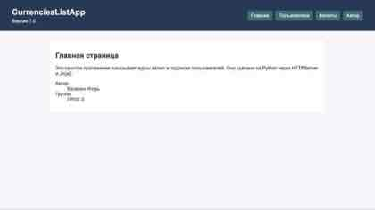
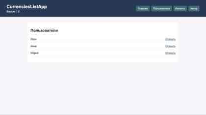
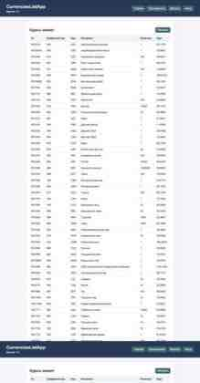
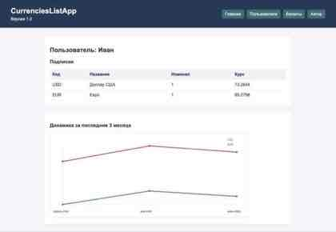
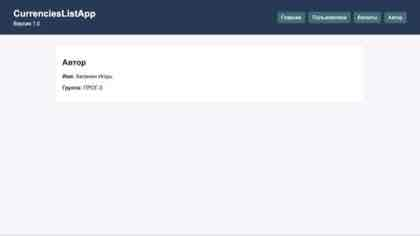

# Лабораторная работа 7

## Цель работы

Цель работы - создать простое клиент-серверное приложение на Python без
серверных фреймворков. В работе используется `HTTPServer`, простая
маршрутизация, шаблоны Jinja2, модели предметной области и тесты.

## Описание предметной области

В приложении есть несколько простых моделей:

- `Author` - хранит имя автора и учебную группу.
- `App` - хранит название приложения, версию и автора.
- `User` - хранит id и имя пользователя.
- `Currency` - хранит данные валюты: id, цифровой код, буквенный код,
  название, курс и номинал.
- `UserCurrency` - связывает пользователя и валюту. Так реализована связь
  "многие ко многим".

Для свойств моделей сделаны геттеры и сеттеры через `property`. В сеттерах
есть простая проверка типов и значений.

## Структура проекта

```text
lab7/
├── README.md
├── requirements.txt
├── myapp/
│   ├── __init__.py
│   ├── myapp.py
│   ├── controllers/
│   │   ├── __init__.py
│   │   ├── authorController.py
│   │   ├── currenciesController.py
│   │   ├── data.py
│   │   └── userController.py
│   ├── models/
│   │   ├── __init__.py
│   │   ├── app.py
│   │   ├── author.py
│   │   ├── currency.py
│   │   ├── user.py
│   │   └── user_currency.py
│   ├── static/
│   │   └── style.css
│   ├── templates/
│   │   ├── 404.html
│   │   ├── author.html
│   │   ├── base.html
│   │   ├── currencies.html
│   │   ├── index.html
│   │   ├── user.html
│   │   └── users.html
│   └── utils/
│       ├── __init__.py
│       └── currencies_api.py
└── tests/
    ├── test_currencies_api.py
    ├── test_models.py
    └── test_server.py
```

## Описание реализации

Приложение сделано по MVC:

- `models` - классы предметной области.
- `templates` - HTML-страницы для отображения данных.
- `controllers` - функции, которые подготавливают данные для шаблонов.
- `myapp.py` - запуск `HTTPServer` и выбор нужного маршрута.

Маршруты:

- `/` - главная страница.
- `/author` - информация об авторе.
- `/users` - список пользователей.
- `/user?id=1` - страница пользователя и его подписки.
- `/currencies` - список валют.

Jinja2 настраивается один раз при старте приложения:

```python
env = Environment(
    loader=PackageLoader("myapp"),
    autoescape=select_autoescape(),
)
```

Это удобно, потому что шаблоны кэшируются, а в обработчиках можно просто
получать шаблон по имени и передавать туда данные.

Данные о валютах берутся функцией `get_currencies` из файла
`utils/currencies_api.py`. Она обращается к XML-сервису ЦБ РФ, разбирает XML и
создает объекты `Currency`. Если при запуске сайта сеть недоступна, приложение
показывает небольшой учебный список валют, чтобы страницы все равно открывались.

На странице пользователя есть простой график на `canvas`. Он показывает учебную
динамику подписанных валют за последние 3 месяца. Для этого не добавлялась
отдельная JavaScript-библиотека, чтобы код оставался проще.

## Как запустить

```bash
cd lab7
python3 -m myapp.myapp
```

После запуска можно открыть:

- `http://localhost:8000/`
- `http://localhost:8000/users`
- `http://localhost:8000/currencies`
- `http://localhost:8000/user?id=1`
- `http://localhost:8000/author`

## Примеры работы приложения

Главная страница показывает название приложения, версию и автора.



Страница `/users` выводит список пользователей и ссылки на их страницы.



Страница `/currencies` выводит таблицу валют: код, название, номинал и курс.
Есть ссылка "Обновить", которая повторно открывает страницу и заново получает
данные.



Страница `/user?id=1` показывает данные пользователя, список его подписок и
график изменения курса за последние 3 месяца.



Страница `/author` показывает автора и учебную группу.



## Тестирование

Для тестов используется стандартный модуль `unittest`.

Запуск тестов:

```bash
python3 -m unittest discover -s lab7/tests
```

Дополнительная проверка синтаксиса:

```bash
python3 -m compileall lab7
```

Тесты проверяют:

- создание моделей и ошибки в сеттерах;
- разбор XML с валютами;
- ошибку при пустом XML;
- ответы маршрутов `/`, `/users`, `/currencies`, `/user?id=...`.

## Выводы

Во время выполнения работы получилось разделить приложение на модели,
контроллеры и шаблоны. Стало понятнее, как работает `HTTPServer`, как вручную
обрабатывать маршруты и query-параметры. Также получилось использовать Jinja2
без фреймворков и написать простые тесты для основных частей приложения.
