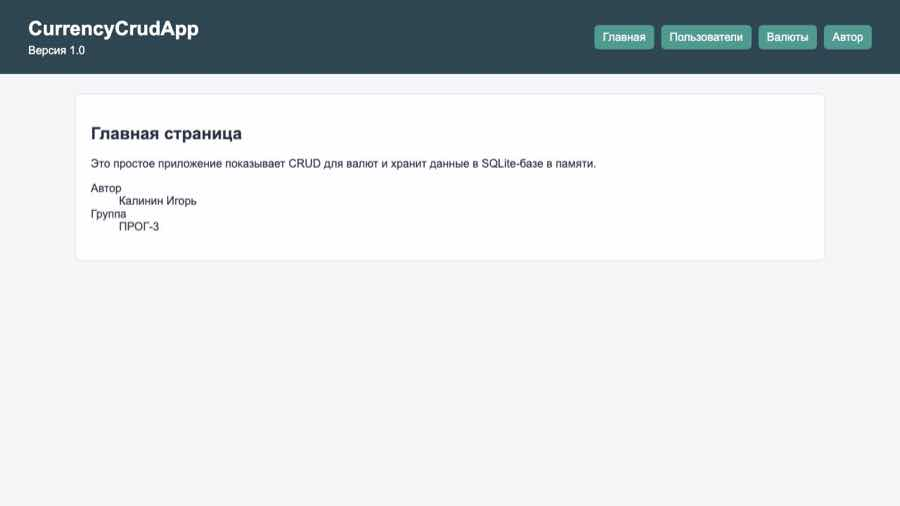
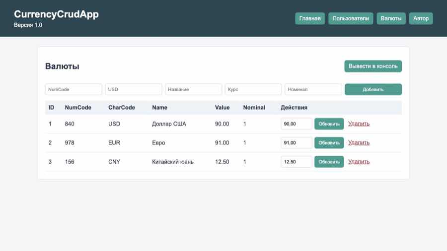
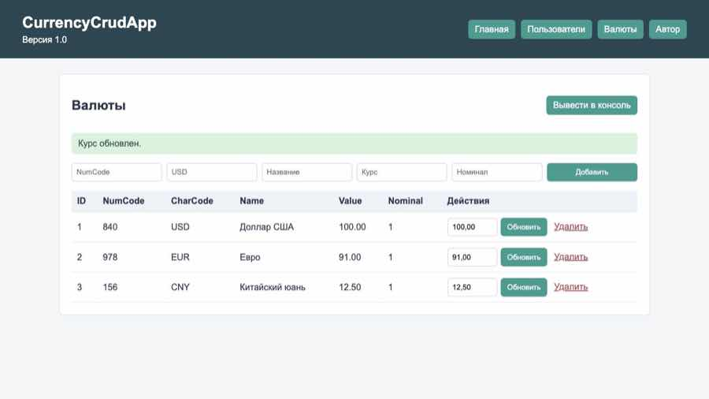
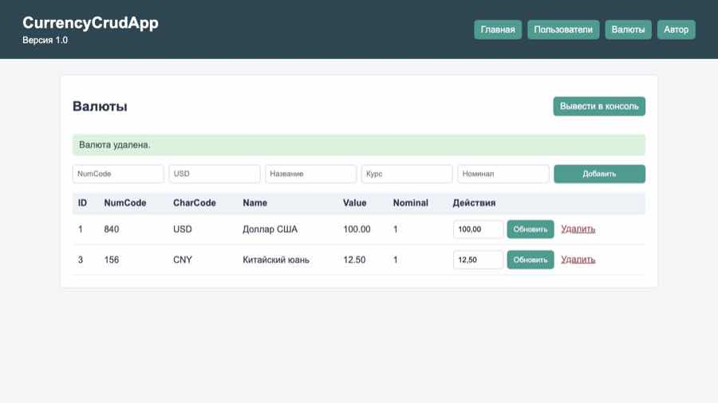
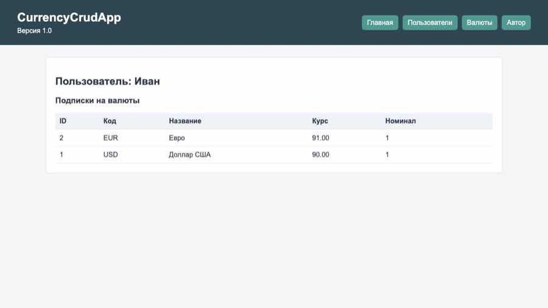

# Лабораторная работа 8

## Цель работы

Цель работы - реализовать CRUD для сущности `Currency`, научиться работать с
SQLite в памяти через `sqlite3.connect(":memory:")`, закрепить MVC и сделать
простой роутер для GET-запросов.

## Описание моделей

В приложении есть такие модели:

- `Author` - имя автора и учебная группа.
- `App` - название приложения, версия и автор.
- `User` - пользователь приложения.
- `Currency` - валюта с цифровым кодом, буквенным кодом, названием, курсом и
  номиналом.
- `UserCurrency` - связь пользователя и валюты.

Связь `UserCurrency` нужна, чтобы один пользователь мог быть подписан на
несколько валют, а одна валюта могла быть у разных пользователей.

Во всех моделях используются свойства через `property`, геттеры и сеттеры.
В сеттерах есть простые проверки типов и значений.

## Первичные и внешние ключи

`PRIMARY KEY` нужен, чтобы у каждой записи был уникальный id. Например, у
каждой валюты есть свой `id`, по которому ее можно обновить или удалить.

`FOREIGN KEY` нужен для связи таблиц. В таблице `user_currency` поля `user_id`
и `currency_id` ссылаются на таблицы `user` и `currency`. Так база понимает,
какой пользователь на какую валюту подписан.

## Структура проекта

```text
lab8/
├── README.md
├── requirements.txt
├── myapp/
│   ├── __init__.py
│   ├── myapp.py
│   ├── controllers/
│   │   ├── __init__.py
│   │   ├── authorController.py
│   │   ├── currenciesController.py
│   │   ├── databaseController.py
│   │   ├── pages.py
│   │   └── userController.py
│   ├── models/
│   │   ├── __init__.py
│   │   ├── app.py
│   │   ├── author.py
│   │   ├── currency.py
│   │   ├── user.py
│   │   └── user_currency.py
│   ├── static/
│   │   └── style.css
│   └── templates/
│       ├── 404.html
│       ├── author.html
│       ├── base.html
│       ├── currencies.html
│       ├── index.html
│       ├── user.html
│       └── users.html
└── tests/
    ├── test_currencies_controller.py
    ├── test_database.py
    ├── test_models.py
    └── test_router.py
```

## Реализация MVC

- `models` - только сущности и проверки свойств.
- `databaseController.py` - работа с SQLite и SQL-запросами.
- `currenciesController.py` - CRUD-логика для валют.
- `userController.py` - получение пользователей и подписок.
- `pages.py` - рендеринг HTML через Jinja2.
- `myapp.py` - запуск сервера и роутер.
- `templates` - HTML-страницы.

Jinja2 `Environment` создается один раз в `myapp.py`:

```python
env = Environment(
    loader=PackageLoader("myapp"),
    autoescape=select_autoescape(),
)
```

## CRUD для Currency

### Create

Добавление валюты сделано через параметризованный запрос:

```python
cursor.execute(
    """
    INSERT INTO currency(num_code, char_code, name, value, nominal)
    VALUES(?, ?, ?, ?, ?)
    """,
    (currency.num_code, currency.char_code, currency.name,
     currency.value, currency.nominal),
)
```

### Read

Получение списка валют:

```python
cursor.execute(
    """
    SELECT id, num_code, char_code, name, value, nominal
    FROM currency
    ORDER BY id
    """
)
```

### Update

Обновление курса по `char_code`:

```python
cursor.execute(
    "UPDATE currency SET value = ? WHERE char_code = ?",
    (float(value), char_code.upper()),
)
```

### Delete

Удаление валюты по id:

```python
cursor.execute("DELETE FROM currency WHERE id = ?", (currency_id,))
```

Все запросы используют параметры, а не склейку строк. Это защищает от простых
SQL-инъекций.

## Маршруты

- `/` - главная страница.
- `/author` - информация об авторе.
- `/users` - список пользователей.
- `/user?id=1` - пользователь и его подписки.
- `/currencies` - таблица валют.
- `/currency/create?...` - добавление валюты.
- `/currency/update?USD=100` - обновление курса валюты.
- `/currency/delete?id=1` - удаление валюты.
- `/currency/show` - вывод валют в консоль.

## Как запустить

```bash
cd lab8
python3 -m myapp.myapp
```

После запуска открыть:

- `http://localhost:8001/`
- `http://localhost:8001/currencies`
- `http://localhost:8001/users`
- `http://localhost:8001/user?id=1`

## Примеры работы приложения

Главная страница:



Таблица валют:



Обновление курса:



Удаление валюты:



Страница пользователя с подписками:



## Тестирование

Для тестов используется стандартный `unittest` и `unittest.mock`.

Запуск:

```bash
python3 -m unittest discover -s lab8/tests
```

Дополнительная проверка синтаксиса:

```bash
python3 -m compileall lab8
```

В тестах проверяются:

- модели и их валидация;
- CRUD-операции SQLite;
- `CurrenciesController` через `MagicMock`;
- маршруты `/`, `/currencies`, `/currency/update`, `/currency/delete`,
  `/user?id=...`.

Результат:

```text
Ran 17 tests
OK
```

## Выводы

В ходе работы получилось сделать простой CRUD для валют, использовать SQLite в
памяти и разделить код по MVC. Также стало понятнее, зачем нужны первичные и
внешние ключи, как писать параметризованные SQL-запросы и как проверять
контроллеры через `unittest.mock`.
